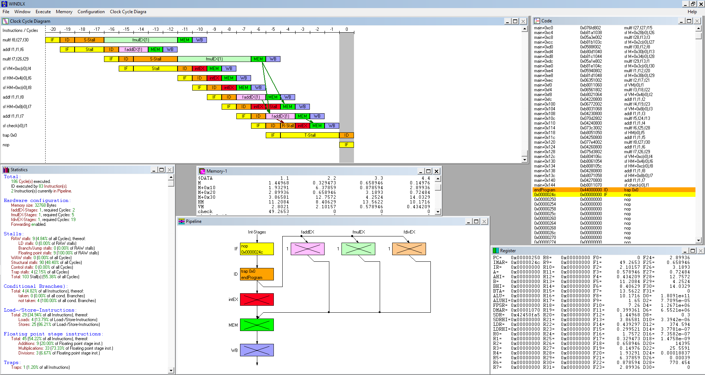

# DLX OPTIMIZATION
Creation and optimization of a DLX program that performs some math calculations. To see this operations, just look at **Practica_DLX.pdf** doc or click here for more information.
(For more information click [here](docs/Practica_DLX.pdf))

  

## Optimizations and improvements
To optimize the code in first place, they were used some technics to reorder and expand code in order to improve pipeline activity, but I reached the limit too fast, so I decided to improve the way operations were executed. This 2nd try was based on maths and try to reorder the operations trying to avoid some of them and lower the limit of cycles reached in the 1rst version.
This is the idea, but my optimization might not be the best, other people can carry out these optimizations in different ways taking out other common factors that do the same but better.

## Usage
To be executed in modern computers it is necessary to do it in an emulator such as WinDLX.
Just download **DLX_Project folder** and execute in the emulator the **.S** file that you want to test.